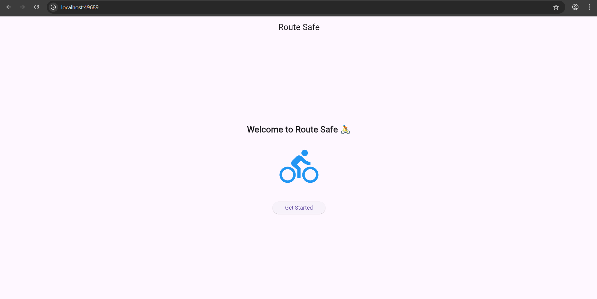

# SafeStride

## Overview

SafeStride is a mobile-first platform designed to help runners and cyclists in busy urban environments discover safe, reliable, and community-validated routes.

In many cities, fitness enthusiasts struggle to identify routes that are not only efficient but also safe and well-reviewed by real users. Existing map solutions often optimize for distance or speed, but rarely for on-ground safety and community trust.

SafeStride addresses this gap by combining Flutter’s cross-platform UI capabilities with Firebase’s real-time backend to surface routes backed by real user experiences.

---

## Problem Statement

Runners and cyclists in busy cities lack access to safe, well-reviewed routes or community-endorsed paths. This often leads to unsafe route choices, poor user confidence, and fragmented fitness experiences.

---

## Our Solution

SafeStride enables users to:

- Discover routes recommended by real runners and cyclists  
- View community-backed route data in real time  
- Contribute new route insights to help other users  
- Access continuously synced data powered by Firebase  

The current MVP demonstrates real-time data synchronization using Cloud Firestore, forming the foundation for a community-driven route intelligence platform.

---

## Current MVP Scope

The present implementation focuses on:

- Firebase integration with Flutter  
- Real-time data updates using Cloud Firestore  
- Reactive UI using StreamBuilder  
- Scalable backend foundation for future route intelligence features  

Future iterations will expand into route safety scoring, user reviews, and personalized route recommendations.

---

## Tech Stack

- Flutter  
- Dart  
- Firebase Core  
- Cloud Firestore  
- Firebase Authentication

---

## Firebase Integration (Assignment Scope)

This sprint focuses on integrating Firebase as the backend for SafeStride’s mobile experience. The goal is to demonstrate real-time data synchronization and a scalable cloud-connected architecture using Flutter and Firebase.

### What will be Implemented

- Firebase project setup and app registration  
- FlutterFire configuration  
- Firebase initialization in the Flutter app  
- Cloud Firestore integration  
- Real-time UI updates using StreamBuilder  

---

## Real-Time Data Flow

The application uses Cloud Firestore’s snapshot streams to keep the UI in sync with the database.

Flow:

1. User taps the add button  
2. A new document is written to Firestore  
3. Firestore emits a real-time update  
4. StreamBuilder rebuilds the affected UI  
5. Updated data appears instantly without refresh  

This demonstrates the reactive and real-time capabilities required for SafeStride’s future community-driven features.

---

## Demo



---

## Reflection

Firebase significantly reduces backend complexity by providing authentication, real-time database capabilities, and scalable infrastructure out of the box. This allows SafeStride to focus on delivering a responsive, community-powered routing experience while maintaining a production-ready foundation.

## 📁 Project Structure

```
lib/
├── main.dart
├── firebase_options.dart
├── screens/
       ├──welcome_screen.dart 
├── widgets/
       ├──custom_button.dart
├── models/
├── services/
```

---

## 🧩 Purpose of Each Directory

- **main.dart** — Entry point of the app and root configuration  
- **screens/** — Full UI pages (each file = one screen)  
- **widgets/** — Reusable UI components  
- **models/** — Data structures and JSON mapping  
- **services/** — Firebase/API interaction layer  
- **utils/** — Helper functions, constants, and validators  

---

## 🏗️ How This Supports Modular Design

This structure separates UI, data, and service logic into independent layers.  
It improves readability, enables code reuse, and makes the app easier to scale and maintain as new features are added.

---

## 🧷 Naming Conventions

- **Files:** `snake_case.dart` → `welcome_screen.dart`  
- **Classes:** `PascalCase` → `WelcomeScreen`  
- **Variables/Functions:** `camelCase` → `isLoading`, `fetchRoutes()`  
- **Widgets:** Screens end with `Screen`; reusable widgets have descriptive names.

---

## 🎯 Why This Matters

A consistent structure and naming convention keeps the codebase clean, scalable, and team-friendly for future development.

---

## 📚 Case Study: Syncly - The To-Do App That Wouldn't Sync

### Challenge Analysis
The Syncly team faced issues with real-time updates, image uploads, and secure sessions. Users experienced delays in data synchronization, and the team lacked a scalable backend infrastructure.

### Solution with Firebase
By integrating Firebase, we addressed these challenges effectively:

1.  **Authentication (Firebase Auth):**
    -   **Problem:** Need for secure user sessions without building a custom auth server.
    -   **Solution:** We implemented Firebase Authentication to handle sign-up, sign-in, and session management. This ensures that only authenticated users can access their tasks, providing security and personalization out of the box.

2.  **Real-Time Data Sync (Cloud Firestore):**
    -   **Problem:** Updates weren't syncing in real-time; changes took minutes to appear.
    -   **Solution:** We utilized Cloud Firestore's real-time capabilities. By using `StreamBuilder` in Flutter to listen to Firestore snapshots, any change made to the database (add/update/delete) is *instantly* pushed to all connected client devices. This eliminates the need for manual refresh or polling, solving the synchronization delay.

3.  **Scalable Storage (Firebase Storage):**
    -   **Problem:** Difficulty handling file uploads and storage scalability.
    -   **Solution:** Firebase Storage provides a robust and scalable way to store user-generated content like images/files. It handles the complexity of file hosting, security rules, and scaling storage needs as the user base grows. *(Note: While the current demo focuses on Auth and Firestore, Storage is the designated solution for this requirement)*.

### Enhancing Scalability, Real-Time Experience, and Reliability
-   **Scalability:** Firebase is a serverless platform that automatically scales with your app's usage. We don't need to provision servers or worry about traffic spikes; Firebase handles the infrastructure.
-   **Real-Time Experience:** Firestore's listener-based model ensures that the UI is always a reflection of the latest server state. This creates a seamless and responsive user experience where collaboration happens instantly.
-   **Reliability:** Google's infrastructure backs Firebase, ensuring high availability and uptime. SDKs also handle offline persistence, allowing the app to work even with intermittent network connectivity and sync when back online.
